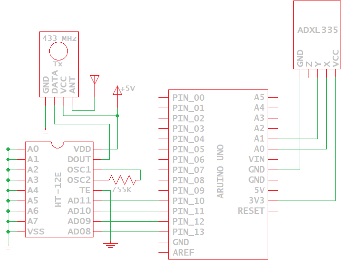
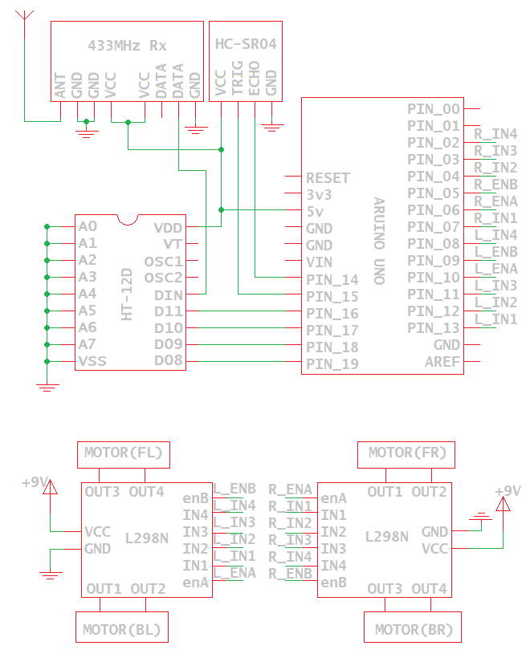

# Gesture Controlled Robot
A gesture controlled robot is a simple vehicle, whose movement is
controlled by the gestures or movement of a simple controller. Depending on the
gesture made using the controller, the robot can move forward, backward, left,
right or come to a halt.

## Features
* Wireless control
* Forward/Backward motion with 3-level speed controls
* Turn Left/Right both with and without forward/backward motion
* Front obstacle sensing to prevent collision during motion

## File organization
* `docs/`: This folder contains all related documents. This includes all the
   component data sheets, Project reports etc.
* `gesture_control/`: Source code for gesture controller.
  + ADC: `adc.h`, `adc.cpp`
  + GPIO: `gpio.h`, `gpio.cpp`
  + Encoder + Transmitter: `transmit.h`, `transmit.cpp`
  + Helper macros: `reg_ops.h`
  + Main: `gesture_control.ino`
 
* `vehicle_control/`: Source code for vehicle controller.
  + GPIO: `gpio.h`, `gpio.cpp`
  + Obstacle detection & safe distance: `distance.h`, `distance.cpp`
  + Drive System: Vehicle movement warpped into a single interface in `drive.h`
    and `drive.cpp`
  + Motor Control (Used by Drive System): I`motor.h`, `motor.cpp`
  + Receiver + : `gpio.h`, `gpio.cpp`
  + Receiver + Decoder: `receiver.h`, `receiver.cpp`
  + Helper macros: `reg_ops.h`
  + Main: `vehicle_control.ino`

## Software Setup
Download and install the [Arduino IDE](https://www.arduino.cc/en/Main/Software/).
Arduino IDE is used to edit, compile as well as uploading the code to the
Arduino Uno board.

## Hardware and Pin Setup
This project can be broadly classified and designed into two major parts:

### Gesture Controller (Transmitter)
The components used on the transmitter side include:
* 3 axis accelerometer(ADXL335) (we use only 2 axis),
* Encoder(HT12E)
* 433MHz RF transmitter
* A simple copper wire to be used as an antenna
* Arduino Uno (Rev3) built using the ATmega32 chip.



Connect the X and Y pins of the accelerometer to analog pins A0 and A1 of the
Arduino board. Also connect the digital pins 10, 11, 12 and 13 of the Arduino
to pins 8, 9, 10 and 11 of the digital encoder HT12E. The data pin of the
transmitter is connected to DOUT (Pin 17) of the encoder. The rest of the
connections are as shown in the wiring diagram.

### Vehicle Controller (Receiver)
The components used on the receiver side include:
* 433MHz RF receiver
* Decoder (HT12D),
* 2 dual H-bridge motor drivers( L298N)
* 4 DC motors (3-12V)
* Ultr-Sonic sensor(HC-SR04).



Connect the 2 data pins of the RF receiver to the DIN pin( Pin 14) of the
decoder. The digital output pins 10, 11, 12 and 13 of the decoder are connected
to pins 16,17,18 and 19 to read the decoded data. This data is in turn used for
the motor control using an H bridge with the following connections made for the
4 motors, each having an enable pin and 2 IN pins (refer to
[motor.cpp](vehicle_control/motor.cpp)):

```c
#define L298N_L_EN_B  (GPIO_PIN_9)
#define L298N_L_IN_3  (GPIO_PIN_11)
#define L298N_L_IN_4  (GPIO_PIN_8)

#define L298N_L_EN_A  (GPIO_PIN_10)
#define L298N_L_IN_1  (GPIO_PIN_13)
#define L298N_L_IN_2  (GPIO_PIN_12)

#define L298N_R_EN_A  (GPIO_PIN_6)
#define L298N_R_IN_1  (GPIO_PIN_7)
#define L298N_R_IN_2  (GPIO_PIN_4)

#define L298N_R_EN_B  (GPIO_PIN_5)
#define L298N_R_IN_3  (GPIO_PIN_3)
#define L298N_R_IN_4  (GPIO_PIN_2)
```

The TRIG and ECHO pin of the ultrasonic sensor are connected to the A0 and A1
pin of the Arduino. The rest of the connections are as seen in the wiring
diagram.

## Putting it all together
The X and Y values are read by the accelerometer based on the gestures made.
These values are read via ADC (refer to adc.h) and are compared with predefined
reference values for X and Y axes to encode the 4 digital pins for directions
and speed values.
> The endoing of the 4 pins are bit complex. Refer to the Project Report for the
> same.

The data is then transferred via the RF transmitter.

On the receiver side, these values are further decoded for direction and speed
control by making the respective motors rotate clockwise/anti-clockwise as well
as varying the PWM for speed control respectively. Also, an ADC read on pins A0
and A1 are used for obstacle detection, thus stopping the forward movement of
the vehicle if an obstacle is detected within a safe distance (distance.h and
distance.cpp).

## References
* [Getting started with Arduino](https://www.arduino.cc/en/Guide/HomePage)
* [ATMega328 (Arduino Uno) Data Sheet](docs/ATMEGA328_datasheet.pdf)
* [L298N Data Sheet (Dual Full-Bridge Driver)](docs/)
* [Encoder (HT-12E) Data Sheet](docs/HT12E.pdf)
* [Decoder (HT-12D) Data Sheet](docs/HT12D.pdf)
* [Transmitter Data Sheet](docs/RF434_transmitter.pdf)
* [Receiver Data Sheet](docs/RF434_receiver.pdf)
* [Accelerometer (ADXL335) Data Sheet](docs/adxl335.pdf)
* [Ultra-Sonic Sensor (HC-SR04) Data Sheet](docs/HCSR04.pdf)